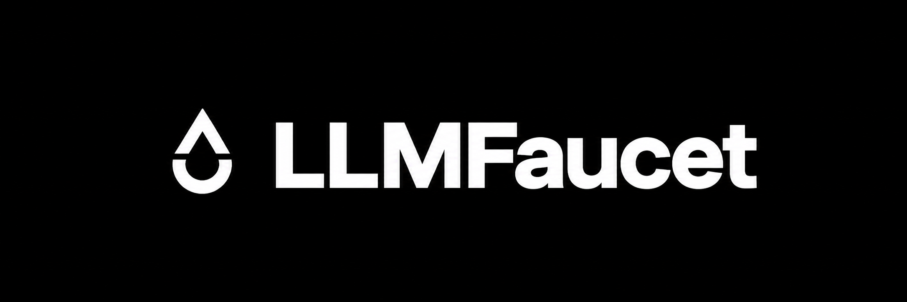

<div align="center">
  
</div>

<br />

<div align="center">

# llmfaucet

### One endpoint. Free AI models. No keys, no setup.

A public, OpenAI-compatible gateway that routes requests across AI providers with officially available anonymous access.

[Website](https://llmfaucet.dev) · [API Status](https://llmfaucet.dev/status) · [Documentation](https://llmfaucet.dev/docs) · [Sponsor](https://github.com/sponsors/justinedevs)

</div>

<br />

> [!WARNING]
> llmfaucet is built for experimentation, learning, prototypes, open-source projects, and personal workflows. Free upstream capacity can change, slow down, or disappear without notice. Do not depend on it for critical production workloads.

## Why llmfaucet?

Most AI providers have free models, trial capacity, or anonymous endpoints. Using them separately is frustrating: every service has a different API format, model list, rate limit, and availability pattern.

llmfaucet gives AI agents and applications one public endpoint instead.

```text
Your agent or application
          │
          │  https://api.llmfaucet.dev/v1
          ▼
      llmfaucet
          │
          ├── Pollinations
          ├── LLM7
          ├── OpenCode Zen
          ├── OVH AI Endpoints
          └── AI Horde
```

The gateway selects a compatible healthy model, retries another source when one is unavailable, and returns an OpenAI-compatible response.

## Features

| Feature | Description |
|---|---|
| Public endpoint | Use one hosted API URL without self-hosting infrastructure |
| No upstream keys | llmfaucet only integrates sources with anonymous or keyless access |
| OpenAI compatible | Works with clients that support `/v1/chat/completions` |
| Agent-friendly | Designed for Claude Code, Codex CLI, Cline, Roo Code, Continue, Aider, and other coding tools |
| Smart routing | Selects models based on capability, health, speed, and current availability |
| Automatic fallback | Tries another compatible upstream after rate limits, upstream failures, or timeouts |
| Streaming | Supports streamed responses where the selected upstream supports streaming |
| Model selectors | Choose `auto`, `auto:fast`, `auto:smart`, or `auto:coding` |
| Honest limits | Returns rate-limit and retry headers so tools can back off correctly |
| Privacy-first | No upstream API keys are collected from free users |

## Quick start

Use the public OpenAI-compatible endpoint:

```bash
curl https://api.llmfaucet.dev/v1/chat/completions \
  -H "Authorization: Bearer free" \
  -H "Content-Type: application/json" \
  -d '{
    "model": "auto",
    "messages": [
      {
        "role": "user",
        "content": "Explain what an API gateway does in one paragraph."
      }
    ]
  }'
```

The `Authorization` header is optional for anonymous use in most supported clients, but some SDKs require a value. Use `free` when a placeholder API key is required.

## Model selectors

You do not need to know which upstream model is available. Use a selector and let llmfaucet choose.

| Model | Best for | Routing behavior |
|---|---|---|
| `auto` | General use | Balanced quality, speed, and availability |
| `auto:fast` | Quick tasks | Prioritizes lower latency models |
| `auto:smart` | Harder reasoning | Prioritizes stronger available models |
| `auto:coding` | Coding agents | Prioritizes code-focused models and tool-capable routes |
| Specific model ID | Advanced users | Requests a named model when it is currently available |

Example:

```json
{
  "model": "auto:coding",
  "messages": [
    {
      "role": "user",
      "content": "Write a TypeScript function that retries fetch requests with exponential backoff."
    }
  ]
}
```

## Supported capacity sources

llmfaucet only uses publicly available, anonymous, or explicitly keyless AI sources. Availability changes often, so the live catalog is always the source of truth.

| Source | Role in llmfaucet | Typical capabilities |
|---|---|---|
| Pollinations | Primary general-purpose capacity | Chat, code, image, audio, and selected multimodal models |
| LLM7 | General and reasoning fallback | General chat, coding, reasoning, long-form tasks |
| OpenCode Zen | Coding-focused capacity | Code generation, agent tasks, software engineering |
| OVH AI Endpoints | Reliable open-model fallback | Open-weight text models, selected vision and media models |
| AI Horde | Community overflow capacity | Community-hosted text and image models |

### Catalog expectations

- Models may be added, removed, renamed, or temporarily unavailable.
- A listed upstream may reject a request due to its own policies or limits.
- The same model can exist through multiple upstreams.
- llmfaucet may route a request to a compatible alternative when the requested model is unavailable.
- The response includes routing headers so you can inspect what served the request.

```text
X-Routed-Via: pollinations/qwen3-coder
X-Fallback-Attempts: 1
X-RateLimit-Remaining: 17
X-RateLimit-Reset: 2026-08-25T00:00:00Z
```

## How routing works

Every request goes through a small routing process.

1. llmfaucet checks whether the request needs special support such as images, tools, structured JSON, or long context.
2. It removes models that cannot support those requirements.
3. It removes sources currently marked unhealthy, overloaded, or rate-limited.
4. It scores the remaining routes using model capability, observed speed, and recent availability.
5. It forwards the request to the best route.
6. If an upstream returns a temporary error, llmfaucet retries another compatible route.
7. If all compatible sources are busy, the request is queued or receives a retry response.

```text
Request
  │
  ├── Need vision, tools, JSON, or code?
  │
  ├── Remove incompatible models
  │
  ├── Remove unhealthy or rate-limited sources
  │
  ├── Rank by selector, speed, quality, and load
  │
  ├── Route to best available source
  │
  └── Retry compatible fallback when needed
```

## Usage limits

Free AI capacity is limited. llmfaucet shares that capacity fairly so one user cannot consume the entire service.

| Access level | Daily request limit | Queue priority | How to access |
|---|---:|---|---|
| Anonymous | 20 requests | Standard | Use the endpoint with `Bearer free` |
| Registered | 50 requests | Higher | Create a free llmfaucet key |
| GitHub Sponsor | Tier-based | Priority | Sponsor the project and link GitHub |

Limits are enforced per IP address for anonymous users and per llmfaucet API key for registered users. Limits reset daily at midnight UTC.

> [!TIP]
> Use `auto:fast` for short tasks, keep prompts focused, and avoid unnecessary retries. This helps free capacity serve more people.

## GitHub Sponsors

llmfaucet is sustained by the people who use it. GitHub Sponsors supports the open-source project while unlocking higher limits and priority access.

| Tier | Monthly support | Daily request limit | Benefits |
|---|---:|---:|---|
| Free | $0 | 20 | Public endpoint and standard queue access |
| Registered | $0 | 50 | Free API key and higher queue priority |
| Supporter | $3/month | 200 | Priority queue and higher daily capacity |
| Pro | $5/month | 500 | Higher priority and access to early features |
| Builder | $10/month | 1,000 | Highest priority and experimental model access |

After sponsoring:

1. Return to [llmfaucet.dev](https://llmfaucet.dev).
2. Sign in with GitHub.
3. Link your active GitHub Sponsors account.
4. Generate an `llmfaucet-...` API key.
5. Paste the key into your AI coding tool or application.

If a sponsorship ends, the key remains valid and automatically falls back to the free tier instead of breaking your existing setup.

[Become a GitHub Sponsor →](https://github.com/sponsors/Hyperkit-dev)

## Coding agents

llmfaucet is designed to work with common coding agents and OpenAI-compatible tools.

| Tool | Provider type | Base URL | Model |
|---|---|---|---|
| Cline | OpenAI Compatible | `https://api.llmfaucet.dev/v1` | `auto:coding` |
| Roo Code | OpenAI Compatible | `https://api.llmfaucet.dev/v1` | `auto:coding` |
| Continue | OpenAI | `https://api.llmfaucet.dev/v1` | `auto` |
| Aider | OpenAI Compatible | `https://api.llmfaucet.dev/v1` | `openai/auto:coding` |
| Codex CLI | Custom provider | `https://api.llmfaucet.dev/v1` | `auto:coding` |
| Claude Code | Anthropic Compatible | `https://api.llmfaucet.dev` | `auto:coding` |
| Cursor | Custom OpenAI API | `https://api.llmfaucet.dev/v1` | `auto:coding` |

### Cline and Roo Code

1. Open provider settings.
2. Select **OpenAI Compatible**.
3. Set the base URL to:

```text
https://api.llmfaucet.dev/v1
```

4. Set API key to `free`, or use your `llmfaucet-...` key.
5. Select `auto:coding`.

### Aider

```bash
aider \
  --openai-api-base https://api.llmfaucet.dev/v1 \
  --openai-api-key free \
  --model openai/auto:coding
```

Replace `free` with your llmfaucet API key to use your registered or sponsor allowance.

### Claude Code

```bash
export ANTHROPIC_BASE_URL="https://api.llmfaucet.dev"
export ANTHROPIC_AUTH_TOKEN="free"

claude
```

> [!NOTE]
> Use `ANTHROPIC_AUTH_TOKEN`, not `ANTHROPIC_API_KEY`. Restart Claude Code after changing these variables.

### Codex CLI

Add the following to `~/.codex/config.toml`:

```toml
[model_providers.llmfaucet]
name = "llmfaucet"
base_url = "https://api.llmfaucet.dev/v1"
env_key = "LLMFAUCET_API_KEY"
wire_api = "responses"
```

Then set your key:

```bash
export LLMFAUCET_API_KEY="free"
```

Use your `llmfaucet-...` key instead of `free` for registered or sponsor access.

## API compatibility

| Endpoint | Status | Purpose |
|---|---|---|
| `GET /v1/models` | Planned | List currently available models and capabilities |
| `POST /v1/chat/completions` | In progress | OpenAI-compatible chat completions |
| `POST /v1/completions` | Planned | Legacy prompt completion and editor autocomplete |
| `POST /v1/responses` | Planned | OpenAI Responses API support for Codex CLI |
| `POST /v1/messages` | Planned | Anthropic Messages API support for Claude Code |
| `POST /v1/messages/count_tokens` | Planned | Anthropic-compatible token counting |
| `POST /v1/embeddings` | Planned | Compatible embedding routing by model family |
| `GET /status` | Planned | Public upstream health and service status |

## Architecture

llmfaucet stays lightweight by acting as a routing layer instead of running expensive models itself.

| Component | Purpose |
|---|---|
| Cloudflare Workers | Public API gateway, request validation, routing, streaming, and fallback |
| Cloudflare KV | Daily budgets, rate-limit counters, cooldowns, and active catalog cache |
| Cloudflare D1 | Catalog history, aggregate statistics, and operational records |
| Cloudflare Queues | Fair waiting room when free sources are saturated |
| Cloudflare Pages | Documentation, landing page, setup guides, and public status site |
| Oracle Cloud Always Free | Scheduled upstream probes, model health checks, and catalog updates |

```text
Coding agent or application
          │
          ▼
api.llmfaucet.dev
          │
          ▼
Cloudflare Worker
  ├── Budget and abuse checks
  ├── Capability filtering
  ├── Health-aware routing
  ├── Short fallback chain
  └── Stream relay
          │
          ▼
Anonymous-capacity providers
```

## Development

### Branch strategy

| Branch | Environment | Domains |
|---|---|---|
| `main` | Production | `llmfaucet.dev` and `api.llmfaucet.dev` |
| `dev` | Preview / staging | `llmfaucet-preview.dev` and `api.llmfaucet-preview.dev` |

Production and preview use isolated Cloudflare Workers, KV namespaces, D1 databases, and queue resources. Preview traffic never consumes production budgets or changes production routing state.

### Local setup

```bash
git clone https://github.com/Hyperkit-dev/llmfaucet.git
cd llmfaucet
npm install
npm run dev
```

Create a local environment file:

```bash
cp .dev.vars.example .dev.vars
```

Run checks before opening a pull request:

```bash
npm run lint
npm run test
npm run typecheck
```

## Roadmap

- [x] Branding and project architecture
- [ ] Public landing page and documentation
- [ ] OpenAI-compatible `/v1/chat/completions`
- [ ] Pollinations adapter and streaming relay
- [ ] Per-IP anonymous budget: 20 requests/day
- [ ] LLM7, OVH, and OpenCode Zen adapters
- [ ] Health probes and live upstream catalog
- [ ] `auto`, `auto:fast`, `auto:smart`, and `auto:coding` routing
- [ ] Public status page and rate-limit headers
- [ ] Registered llmfaucet keys: 50 requests/day
- [ ] GitHub Sponsors linking and priority tiers
- [ ] Anthropic Messages API for Claude Code
- [ ] Responses API for Codex CLI
- [ ] `npx llmfaucet setup` agent configuration CLI
- [ ] AI Horde overflow routing
- [ ] Embeddings, images, and audio support

## Trust and safety

llmfaucet follows a few non-negotiable rules:

- Only use providers that document anonymous, keyless, or otherwise permitted public access.
- Do not scrape private services, bypass paywalls, rotate accounts, or automate account creation.
- Do not expose upstream provider credentials because llmfaucet does not collect them for public routing.
- Apply fair-use limits to prevent one user from exhausting shared capacity.
- Publish service status and known upstream limitations honestly.
- Treat prompts as operational data only; minimize retention and do not sell user prompts.

## Contributing

Contributions are welcome.

Useful areas include:

- New officially permitted anonymous providers
- Provider health checks and capability detection
- OpenAI, Anthropic, and Responses API compatibility
- Coding-agent setup guides
- Rate-limit and routing improvements
- Documentation, examples, and integrations
- Security review and abuse prevention

Before opening a pull request, please include tests and clearly document upstream access terms for any provider integration.

Read the contributing guide: [CONTRIBUTING.md](./CONTRIBUTING.md)

## Support

If llmfaucet helps your work, consider supporting its maintenance through GitHub Sponsors.

<div align="center">

[](https://github.com/sponsors/justinedevs)

</div>

## License

llmfaucet is released under the [MIT License](./LICENSE).

The project may include adapted ideas or attributed implementation patterns from compatible open-source projects. See [NOTICE.md](./NOTICE.md) for third-party acknowledgements.
