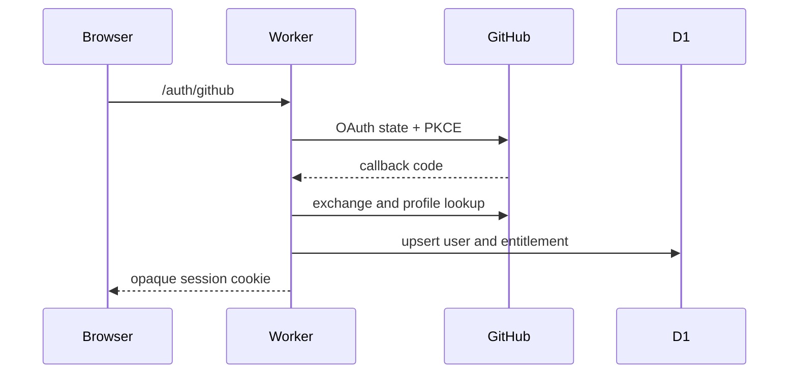

# Authentication flow

```mermaid
sequenceDiagram
  participant Browser
  participant Worker
  participant GitHub
  participant D1
  Browser->>Worker: /auth/github
  Worker->>GitHub: OAuth state + PKCE
  GitHub-->>Worker: callback code
  Worker->>GitHub: exchange and profile lookup
  Worker->>D1: upsert user and entitlement
  Worker-->>Browser: opaque session cookie
```
