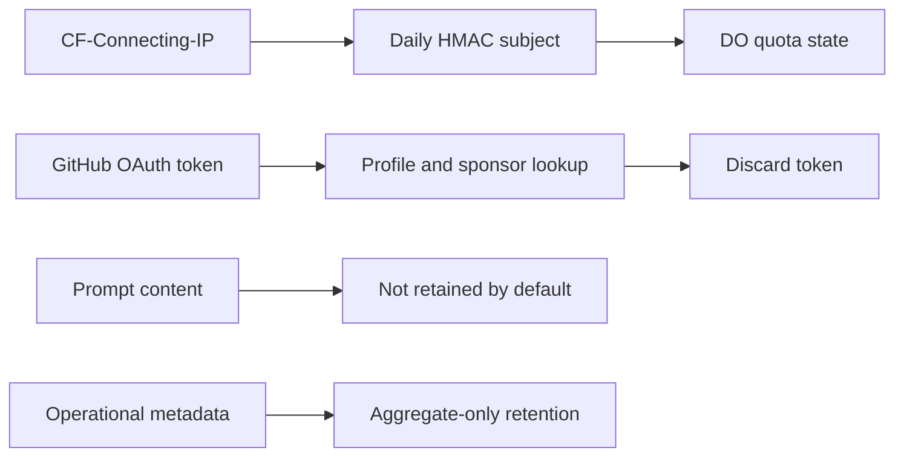

# Data retention flow

```mermaid
flowchart LR
  IP[CF-Connecting-IP] --> HMAC[Daily HMAC subject]
  HMAC --> Counter[DO quota state]
  OAuth[GitHub OAuth token] --> Lookup[Profile and sponsor lookup]
  Lookup --> Discard[Discard token]
  Prompt[Prompt content] --> NoStore[Not retained by default]
  Metrics[Operational metadata] --> Aggregate[Aggregate-only retention]
```
