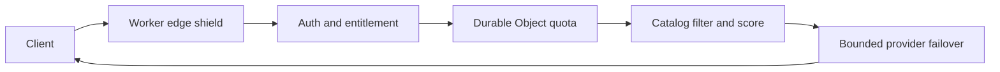

# Request flow

```mermaid
flowchart LR
  Client --> Edge[Worker edge shield]
  Edge --> Auth[Auth and entitlement]
  Auth --> Quota[Durable Object quota]
  Quota --> Router[Catalog filter and score]
  Router --> Provider[Bounded provider failover]
  Provider --> Client
```
