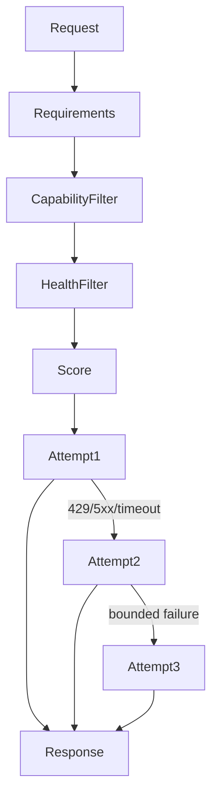

# Routing and fallback flow

```mermaid
flowchart TD
  Request --> Requirements
  Requirements --> CapabilityFilter
  CapabilityFilter --> HealthFilter
  HealthFilter --> Score
  Score --> Attempt1 -->|429/5xx/timeout| Attempt2 -->|bounded failure| Attempt3
  Attempt1 --> Response
  Attempt2 --> Response
  Attempt3 --> Response
```
